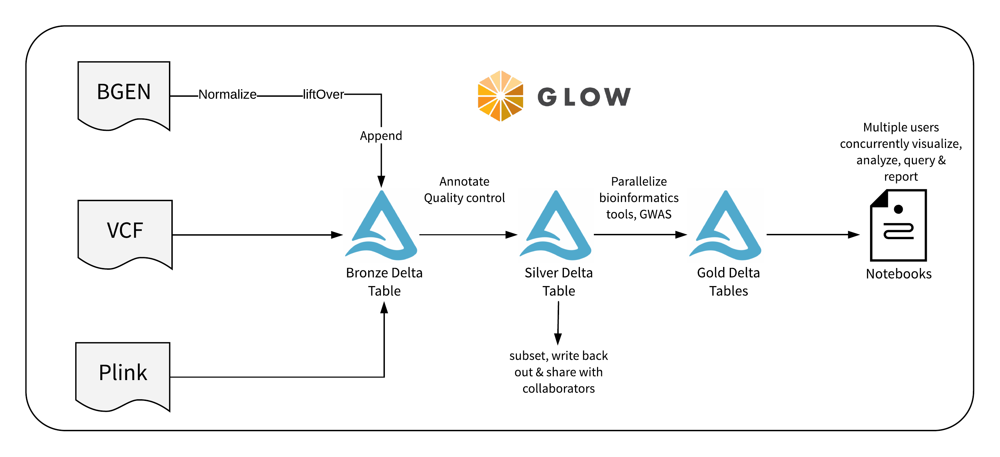

# Glow

## About Glow

Glow is an open-source and independent Spark library that brings even more flexibility and functionality to Azure Databricks. This toolkit is natively built on Apache Spark, enabling the scale of the cloud for genomics workflows.

Glow allows for genomic data to work with Spark SQL. So, you can interact with common genetic data types as easily as you can play with a .csv file.


_Learn more about Project Glow at_ [_projectglow.io_](http://projectglow.io/)_._

_Read the full documentation:_ [_glow.readthedocs.io_](https://glow.readthedocs.io/en/latest/index.html)\_\_


### **Features:**

* **Genomic datasources:** To read datasets in common file formats such as VCF, BGEN, and Plink into Spark DataFrames.
* **Genomic functions:** Common operations such as computing quality control statistics, running regression tests, and performing simple transformations are provided as Spark functions that can be called from Python, SQL, Scala, or R.
* **Data preparation building blocks:** Glow includes transformations such as variant normalization and lift over to help produce analysis ready datasets.
* **Integration with existing tools:** With Spark, you can write user-defined functions \(UDFs\) in Python, R, SQL, or Scala. Glow also makes it easy to run DataFrames through command line tools.
* **Integration with other data types:** Genomic data can generate additional insights when joined with data sets such as electronic health records, real world evidence, and medical images. Since Glow returns native Spark SQL DataFrames, its simple to join multiple data sets together.



## How To Install


If you're using Databricks, make sure you enable the [Databricks Runtime for Genomics](https://docs.databricks.com/runtime/genomicsruntime.html). Glow is already included and configured in this runtime.


### pip Installation

Using pip, install by simply running `pip install glow.py` and then start the [Spark shell](http://spark.apache.org/docs/latest/rdd-programming-guide.html#using-the-shell) with the Glow maven package.

```text
./bin/pyspark --packages io.projectglow:glow_2.11:0.5.0
 --conf spark.hadoop.io.compression.codecs=io.projectglow.sql.util.BGZFCodec
```

### Maven Installation

Install the maven package `io.project:glow_2.11:${version}` and optionally the Python frontend `glow.py`. Set the Spark configuration `spark.hadoop.io.compression.codecs` to `io.projectglow.sql.util.BGZFCodec` in order to read and write BGZF-compressed files.

## Load in Glow

```python
import glow
glow.register(spark)
```

## Read in Data

```python
vcf_path = "/databricks-datasets/genomics/1kg-vcfs/ALL.chr22.phase3_shapeit2_mvncall_integrated_v5a.20130502.genotypes.vcf.gz"

df = spark.read.format("vcf")\
          .option("includeSampleIds", False)\
          .option("flattenInfoFields", False)\
          .load(vcf_path)\
          .withColumn("first_genotype", expr("genotypes[0]"))
```

## Summary Statistics

```python
df = df.withColumn("hardyweinberg", expr("hardy_weinberg(genotypes)")) \
       .withColumn("stats", expr("call_summary_stats(genotypes)"))
```

## Write out Data

```python
df.coalesce(1) \
  .write \
  .mode("overwrite") \
  .format("vcf") \
  .save("/tmp/vcf_output")
```

