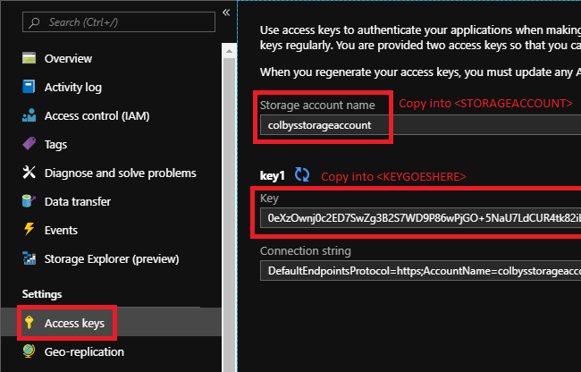
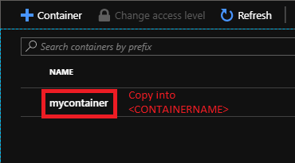

# Azure Storage


Databricks-Specific Functionality


## Mounting Blob Storage

Once you create your blob storage account in Azure, you will need to grab a couple bits of information from the Azure Portal before you mount your storage.

* You can find your Storage Account Name \(which will go in  below\) and your Key \(which will go in  below\) under **Access Keys** in your Storage Account resource in Azure.



* Go into your Storage Account resource in Azure and click on **Blobs**. Here, you will find all of your containers. Pick the one you want to mount and copy  its name into  below.



* As for the mount point \(`/mnt/<FOLDERNAME>` below\), you can name this whatever you'd like, but it will help you in the long run to name it something useful along the lines of `storageaccount_container`.

Once you have the required bits of information, you can use the following code to mount the storage location inside the Databricks environment

```python
dbutils.fs.mount(
  source = "wasbs://<CONTAINERNAME>@<STORAGEACCOUNT>.blob.core.windows.net",
  mount_point = "/mnt/<FOLDERNAME>/",
  extra_configs = {"fs.azure.account.key.<STORAGEACCOUNT>.blob.core.windows.net":"<KEYGOESHERE>"})
```

You can then test to see if you can list the files in your mounted location

```python
display(dbutils.fs.ls("/mnt/<FOLDERNAME>"))
```

### Resources:

* To learn how to create an Azure Storage service, visit [https://docs.microsoft.com/en-us/azure/storage/](https://docs.microsoft.com/en-us/azure/storage/)

## Mounting Data Lake Storage

### Pass-through Azure Active Directory Credentials

```python
configs = {
  "fs.azure.account.auth.type": "CustomAccessToken",
  "fs.azure.account.custom.token.provider.class": spark.conf.get("spark.databricks.passthrough.adls.gen2.tokenProviderClassName")
}
```

```python
dbutils.fs.mount(
  source = "abfss://<CONTAINERNAME>@<STORAGEACCOUNT>.dfs.core.windows.net/",
  mount_point = "/mnt/<FOLDERNAME>",
  extra_configs = configs)
```

